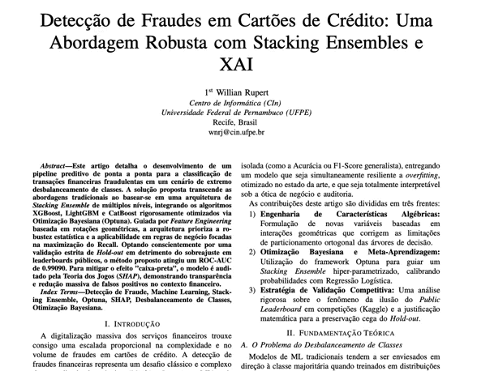
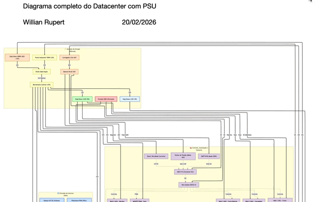
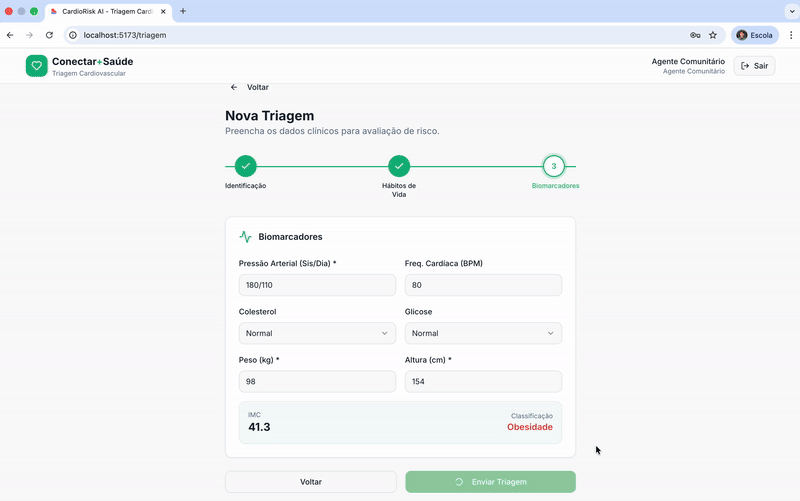

  <!-- HEADER PREMIUM -->
  

  <h2>Building Intelligent Systems & Elegant Digital Experiences</h2>

  

    AI • Data Science • Embedded Systems • Human-Centered Design  
    Transformando complexidade em soluções inteligentes, visuais e eficientes.
  

   

  <!-- SOCIAL BADGES -->
  

    
    &nbsp;
    
    &nbsp;
    
  

   

  <!-- TECH STACK -->
  

---

# 🚀 Featured Projects

  

    <h3 style="color: #4364F7;">💳 Fraud Detection & XAI</h3>
    Robust fraud detection using Stacking Ensembles with model explainability.
      
    
  

  

    <h3 style="color: #4364F7;">🔌 Smart PSU – ESP32 S3</h3>
    Embedded energy management system powered by ESP32-S3 LCD.
      
    
  

  

    <h3 style="color: #4364F7;">🩺 LIGIA AI Health</h3>
    AI-powered cardiac risk prediction and intelligent triage platform.
      
    
  

  

    <h3 style="color: #4364F7;">🪐 NASA Exoplanet LIA</h3>
    Interactive visualization of exoplanet datasets.
      
    
  

  

    <h3 style="color: #4364F7;">🎬 CineMind</h3>
    Intelligent movie recommendation engine.
      
    
  

  

    <h3 style="color: #4364F7;">💻 Projeto IP</h3>
    Interactive game built for Introduction to Programming.
      
    
  

---

# 📊 Activity & Contributions

  

  

    

  

---

  <h3 style="color:#4364F7;">Engineering intelligence into reality.</h3>

  <!-- FOOTER PREMIUM -->
  

