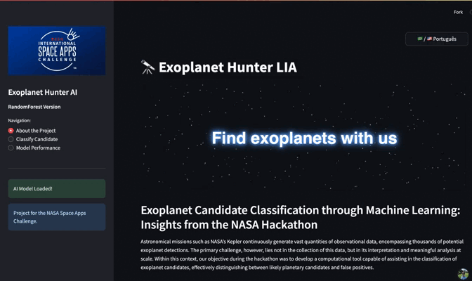
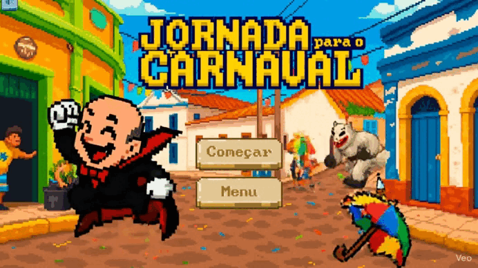
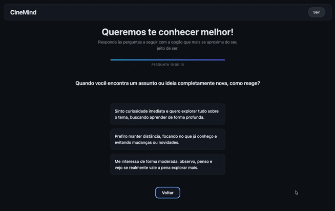

<!-- ─── HEADER ─────────────────────────────────────────────────── -->

  

  <h2>Bem-vindo ao meu Universo Tecnológico 👨‍💻</h2>
  
Desenvolvedor apaixonado por IA, visualização de dados, sistemas inteligentes e design elegante. 
  Busco transformar ideias em experiências digitais fluidas e intuitivas.

  

    
    &nbsp;
    
    &nbsp;
    
  

   

  

---

## 🚀 Projetos em Destaque

  

    
      
    <strong>🪐 NASA Exoplanet LIA</strong> 
    Visualização interativa de dados de exoplanetas.
  

  

    
      
    <strong>💻 Projeto IP</strong> 
    Jogo interativo criado para Introdução à Programação.
  

  

    
      
    <strong>🎬 CineMind</strong> 
    Sistema inteligente de recomendação de filmes.
  

---

## 📊 Estatísticas

  
  
    
  

 

  

---

<footer align="center">
  
</footer>
